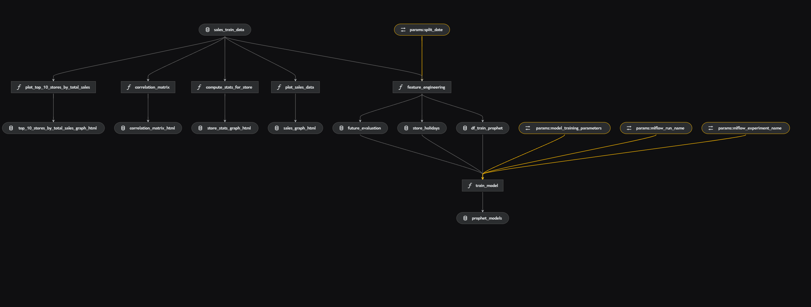

# visionary

[](https://kedro.org)

## Overview

This is a Kedro project for **flight ticket price prediction**. It was generated with Kedro 1.1.1.

Take a look at the [Kedro documentation](https://docs.kedro.org) to get started.

---

## Kedro: What it is and how to run the project

**Kedro** is a framework for building reproducible, maintainable data and ML pipelines. In this project it is used to orchestrate data ingestion, preparation, visualization, feature engineering, and model training in a single workflow.

### How to run the project

1. **Install dependencies** (using the project’s preferred setup):

   ```bash
   uv venv
   source .venv/bin/activate   # macOS / Linux
   .\.venv\Scripts\activate    # Windows
   uv sync
   ```

   Or with pip:

   ```bash
   pip install -r requirements.txt
   ```

2. **Run the full pipeline** (all stages):

   ```bash
   kedro run
   ```

3. **Run a single pipeline** (optional):

   ```bash
   kedro run --pipeline ingestion_pipeline
   kedro run --pipeline fusion_pipeline
   kedro run --pipeline viz_pipeline
   kedro run --pipeline fe_pipeline
   kedro run --pipeline training_pipeline
   ```

4. **Inspect the pipeline** with Kedro Viz:

   ```bash
   kedro viz
   ```

### Development and Kedro Viz

During development, we use **Kedro Viz** to visualize the data pipelines and see how data flows between nodes.



Kedro Viz shows data flow, node outputs, and dependencies at each stage, which helps with iteration and clarity.

### MLflow integration

The project uses **MLflow** for experiment tracking, model versioning, and artifacts. MLflow logs:

- **Model parameters**: CatBoost configuration and hyperparameters
- **Metrics**: RMSE, MAE, R² on train and test sets
- **Artifacts**: Feature importance tables, SHAP importance plots
- **Models**: Trained CatBoost models for versioning and deployment

**View experiments:**

```bash
mlflow ui
```

Then open `http://localhost:5000` to compare runs and view artifacts.

### Rules and guidelines

- Don’t remove lines from the provided `.gitignore`
- Keep results reproducible (data engineering conventions)
- Don’t commit data to the repository
- Don’t commit credentials or local config; keep them in `conf/local/`

### How to test the project

Run tests with:

```bash
pytest
```

Coverage can be configured in `pyproject.toml` under `[tool.coverage.report]`.

### Project dependencies

Dependencies are declared in `pyproject.toml` / `requirements.txt`. Install with `uv sync` or `pip install -r requirements.txt`.

[Further information about project dependencies](https://docs.kedro.org/en/stable/kedro_project_setup/dependencies.html#project-specific-dependencies)

### Working with Kedro and notebooks

Using `kedro jupyter` or `kedro ipython` gives you `context`, `session`, `catalog`, and `pipelines` in scope.

**Jupyter:**

```bash
pip install jupyter
kedro jupyter notebook
```

**JupyterLab:**

```bash
pip install jupyterlab
kedro jupyter lab
```

**IPython:**

```bash
kedro ipython
```

To avoid committing notebook outputs to git, you can use e.g. [nbstripout](https://github.com/kynan/nbstripout) (e.g. `nbstripout --install` in `.git/config`). Outputs remain locally.

### Packaging the project

[Further information about building documentation and packaging](https://docs.kedro.org/en/stable/tutorial/package_a_project.html)

### Virtual environment with uv

You can use **uv** to manage the virtual environment:

```bash
cd your-kedro-project
uv venv
source .venv/bin/activate   # macOS / Linux
.\.venv\Scripts\activate    # Windows
```

To exit: `deactivate`.

---

## Data science at a glance

### Goal

**Predict flight ticket prices** (regression). The pipeline takes raw ticket/price data, cleans and enriches it, builds features, and trains a **CatBoost** model to forecast price. The aim is to support price monitoring or decision support, not to replace airline pricing systems.

### Pipeline stages (high level)

1. **Data ingestion** – Load CSV files from MinIO (or similar S3-compatible storage) and combine them into a single raw dataset.
2. **Data preparation** – Merge all raw CSVs, then filter to keep only flights that have enough observations (e.g. minimum number of price points per route/date/time) so the rest of the pipeline works on meaningful series.
3. **Data visualization** – Produce price evolution plots: for each distinct flight (route, date, time, airline), plot price vs. “days before departure” to inspect how prices change as the departure date approaches.
4. **Feature engineering** – Add temporal and calendar features (e.g. day of week, weekend, month, cyclic encodings), holiday flags for origin/destination countries, and augment with airport distance (e.g. haversine). Then split the data **chronologically** (e.g. 80% train / 20% test) so the model is evaluated on future time periods.
5. **Model training** – Train a **CatBoost** regressor to predict **price** from the engineered features. Metrics (e.g. RMSE, MAE, R²) and artifacts (feature importance, SHAP plots) are logged to MLflow for comparison and model selection.

End-to-end: **raw data → merged & filtered → visualizations → features → train/test split → CatBoost model**, with MLflow used for tracking and versioning.
